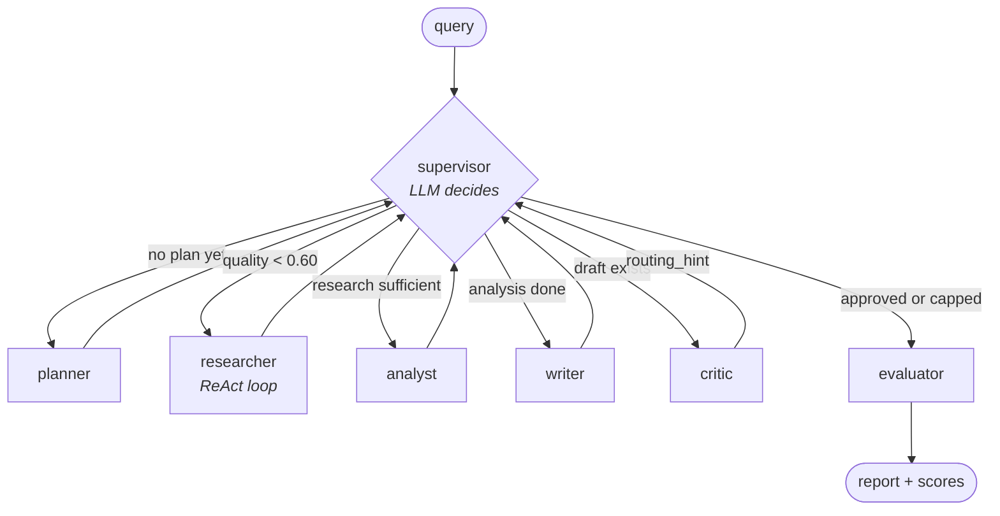

# AMARIS — Autonomous Multi-Agent Research Intelligence System

Ask a research question. Five agents research it autonomously and return a
cited, self-scored report in roughly 60-90 seconds. Runs entirely on free
tiers — monthly cost $0.

The word that matters is **agentic**, not "multi-agent pipeline". A Supervisor
agent with an LLM brain decides what runs next at every step; the Critic can
send work back to the *Researcher*, not just the Writer. No routing is
hard-coded.

<!-- demo: record one run (uvicorn + streamlit, single query, ~90s), save it to
     assets/demo.gif, then uncomment the line below.

-->

> **Status: Tier 0 phases 0-9 and Tier 1 hardening complete.** Full pipeline,
> API, UI, layered evaluation, and the safety and resilience layer all run end
> to end.

## Agentic, not a pipeline

This is the distinction the whole project exists to demonstrate.

| | Fixed pipeline | AMARIS |
|---|---|---|
| Who picks the next step | the edge list, at author time | an LLM, at run time |
| Can a step repeat | no | yes — the researcher often runs 2-3× |
| Can work go backwards | no | yes — the critic can route back to *research* |
| Same query, same path | always | not necessarily |
| Debuggable by re-running | yes | no — hence `session_id` on every log line |



Every agent returns to the supervisor. No agent knows what comes next — that is
the one rule that makes the graph agentic rather than a chain. A real run:

```
planner → researcher → researcher → researcher → analyst → writer → critic → FINISH
```

Three researcher visits because the supervisor read `research_quality` and sent
it back twice. That decision is an LLM call, not an `if`.

## Quick start

```bash
uv sync                      # core stack + dev tools
cp .env.example .env         # PowerShell: Copy-Item .env.example .env
docker compose up -d         # redis + qdrant (local mode only)

# one run, straight to the terminal
uv run python -m amaris.graph.pipeline --query "What is the MCP protocol?"

# or the full local stack
uv run uvicorn amaris.api.main:app      # api on :8000
uv run streamlit run frontend/app.py    # ui on :8501
```

Only `GROQ_API_KEY` is really required; Gemini is the free fallback and
Anthropic is an optional last resort.

uv only — never pip. `pyproject.toml` + `uv.lock` are the source of truth.
Heavy dependencies are opt-in extras (`--extra scraping`, `--extra memory`,
`--extra evaluation`, `--extra full`); every module degrades gracefully when an
extra is absent.

## API

| Method | Path | Purpose |
|---|---|---|
| POST | `/research` | accepts a query, returns `job_id` immediately |
| GET | `/research/{job_id}` | status, current agent, progress, result |
| WS | `/research/{job_id}/stream` | live node transitions |
| GET | `/health` · `/ready` | liveness · readiness |

```bash
curl -X POST localhost:8000/research \
     -H "Content-Type: application/json" \
     -d '{"query":"What is the MCP protocol?"}'
```

The run outlives the request — it is an `asyncio` task tracked in the job
store, so a dropped client does not kill it. Progress is weighted by which
agent is active and clamped monotonic, because a critic → researcher re-route
would otherwise walk the bar backwards.

## How it's evaluated

A single RAGAS score over the final report would measure a retrieve-then-
generate system. Most of what decides quality here happens in routing, so
evaluation is split into three layers that each score what they can actually
see:

| Layer | Scores | Method |
|---|---|---|
| 1 · retrieval | sources vs the query | RAGAS `context_precision`, `context_recall` |
| 2 · report | report vs sources and vs query | RAGAS `faithfulness`, `answer_relevancy` |
| 3 · trajectory | the routing path itself | custom, **no LLM calls** |

Layer 3 is the one no off-the-shelf tool can provide: `routing_accuracy`
re-derives the documented supervisor rule table and checks the LLM actually
followed it, and `react_discipline` measures how often the researcher stopped
because it was satisfied rather than because it hit the iteration cap. Because
it needs no judge, it keeps working when the judge is rate limited.

```bash
uv sync --extra evaluation
uv run python -m amaris.evaluation.harness --golden tests/golden/queries.yaml
```

## Safety

Regex only — no model call, no extra dependency. A safety layer that needs an
LLM fails exactly when the LLM is already failing.

- **Input** is validated once at the edge: junk and high-risk injection are
  refused, PII is masked, and the masked query is what actually runs.
- **Output** is masked for PII that leaked in from scraped pages. It never blocks.
- **Retrieved content is wrapped**, never blocked. Every scraped page is
  delimited in `<untrusted_source_content>` tags with a standing instruction
  that text inside is data to analyse, never instructions to follow — and a page
  cannot close the wrapper early, because both tags are neutralised first.

Indirect injection is the real risk in a system that fetches arbitrary URLs and
feeds them to an LLM. Blocking scraped text would silently kill legitimate
research, so it is contained instead.

## Deploy

**Streamlit Community Cloud** — entrypoint `frontend/app.py`. Community Cloud
looks for `uv.lock` *first*, ahead of `requirements.txt`, so the committed lock
is the dependency file and no pip export is needed.

Paste the contents of [.streamlit/secrets.toml.example](.streamlit/secrets.toml.example)
into the app's Secrets box and fill in the keys. **Keep every key at the root
level** — Streamlit only promotes root-level entries to environment variables,
and that is how `pydantic-settings` reads them; anything nested under a
`[section]` is invisible and the app boots with no provider configured.

Set `DEPLOYMENT_MODE = "cloud"` there. Cloud mode has no Docker, so Streamlit
runs the pipeline in-process, job state lives in memory, and Redis, Qdrant and
mem0 degrade to no-ops. The cloud build installs core dependencies only, so the
RAGAS layers are absent and the UI shows the critic's scores alone.

**Local** — `docker compose up -d` for Redis and Qdrant, then the API and
Streamlit commands above.

## Observability

Because an LLM chooses the execution path, two runs of the same query take
different routes — re-running is not a reproduction. Every run is therefore
keyed on a `session_id` that appears on every log line:

```
16:42:43.199 INFO  36333434:supervisor  supervisor.route  next_agent=researcher quality=0.0
16:42:43.199 DEBUG 36333434:researcher  researcher.react_step  task_id=t1 iteration=1
16:42:43.199 WARN  36333434:researcher  llm.fallback  provider=groq to=gemini reason=429
```

The same records land in `logs/amaris.jsonl` as JSON, with errors mirrored to
`logs/errors.jsonl`. Filtering `supervisor.route` for one session prints the
exact agent path the system chose.

## Tests

```bash
uv run pytest
uv run pytest --cov=amaris --cov-report=term-missing
uv run ruff check . && uv run ruff format --check .
```

330 tests, 83% line coverage, no network calls in the default suite — every
LLM, search and store is a test double. Tests marked `integration` need
`docker compose up`; tests marked `live_llm` are skipped by default.

## Build phases

| # | Phase | Delivers | Status |
|---|---|---|---|
| 0 | Scaffolding | docs, uv project, package layout, logging | ✅ done |
| 1 | Foundation | settings.py, state.py, llm/router.py | ✅ done |
| 2 | Tools | search, scraper, code executor, vector, MCP | ✅ done |
| 3 | Memory | redis (with fallback), mem0 | ✅ done |
| 4 | Agents | supervisor + planner/researcher/analyst/writer/critic | ✅ done |
| 5 | Pipeline | nodes, edges, StateGraph, checkpointing | ✅ done |
| 6 | Evaluation | layered — retrieval, report, trajectory | ✅ done |
| 7 | API | FastAPI + WebSocket progress stream | ✅ done |
| 8 | Frontend | Streamlit, dual mode, custom CSS | ✅ done |
| 9 | Tests + deploy | full suite, README, Streamlit Cloud config | ✅ done |

**Tier 1 hardening — ✅ done.** 4-provider fallback chain, structured-output
validation with a repair retry, startup config validation, readiness probes,
PII masking + input guardrails, and prompt-injection defense.

## Tech stack

| Layer | Choice | Free tier |
|---|---|---|
| Orchestration | LangGraph + SqliteSaver | open source |
| LLM (primary) | Groq openai/gpt-oss-120b / gpt-oss-20b | free, no card |
| LLM (fallbacks) | Gemini 3.6 Flash (free), GLM-4.5-Flash via Z.ai (free), Anthropic Claude (paid, last resort) | mixed |
| Search | DuckDuckGo (`ddgs`), Tavily optional | free / 1000 mo |
| Scraping | Crawl4AI | open source |
| Memory | mem0 + Qdrant | open source / 1GB cloud |
| Ops state | Redis, with in-memory fallback | open source |
| Evaluation | RAGAS (Groq judge, Gemini embeddings) + custom trajectory metrics | open source |
| API | FastAPI + WebSockets | — |
| UI | Streamlit + custom CSS | free public URL |
| Logs | loguru → console + JSONL | — |
| Safety | regex PII masking, guardrails, injection wrapping | no dependency |

## Documentation

Design docs — PRD, architecture, every agent's system prompt, the memory
boundaries and the ADR log — live under `docs/` in the working tree. That
directory is excluded by `.gitignore` and is not published here.

## License

MIT — see [LICENSE](LICENSE).
