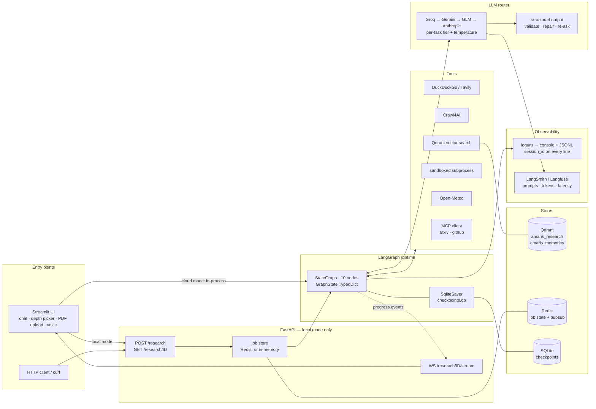
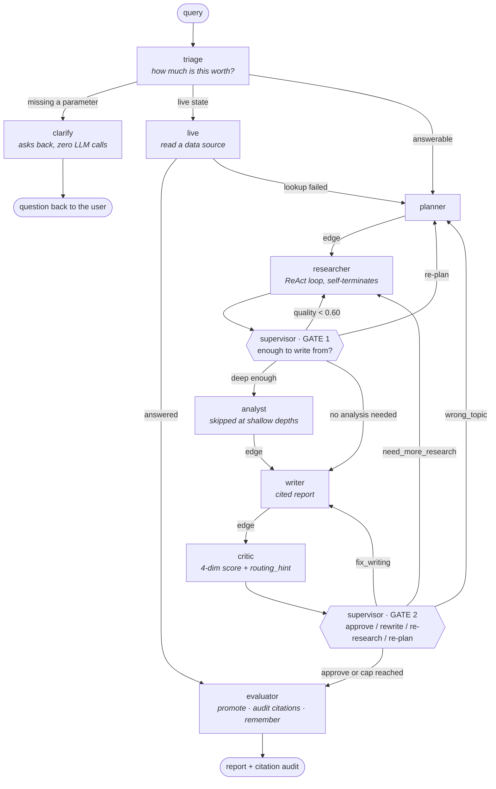

# AMARIS — Autonomous Multi-Agent Research Intelligence System

Ask a research question. A team of agents plans it, researches it, writes it up,
reviews its own draft, and returns a cited report whose every figure has been
checked back against the page it came from.

The word that matters is **agentic**, not "multi-agent pipeline". A supervisor
agent with an LLM brain decides what runs next at the two points where the next
step is genuinely undecided; the critic can send work back to the *researcher*,
not just the writer. Nothing about the path is hard-coded — and equally, no LLM
call is spent on a hop that state already determines.

Runs entirely on free tiers. Monthly cost: **$0**.

> **Status —** Tier 0 (phases 0-9) and Tier 1 hardening complete. Pipeline, API,
> UI, evaluation, safety and observability all run end to end.

<!-- demo: record one run (uvicorn + streamlit, single query, ~90s), save it to
     assets/demo.gif, then uncomment the line below.

-->

---

## Contents

[Agentic, not a pipeline](#agentic-not-a-pipeline) ·
[End-to-end architecture](#end-to-end-architecture) ·
[The graph](#the-graph-what-actually-runs) ·
[Agents](#the-agents) ·
[Quick start](#quick-start) ·
[What you can do with it](#what-you-can-do-with-it) ·
[Evaluation](#how-quality-is-measured) ·
[Safety](#safety) ·
[Observability](#observability) ·
[Storage](#where-state-actually-lives) ·
[API](#api) ·
[Tests](#tests) ·
[Deploy](#deploy) ·
[Tech stack](#tech-stack)

---

## Agentic, not a pipeline

This is the distinction the whole project exists to demonstrate.

| | Fixed pipeline | AMARIS |
|---|---|---|
| Who picks the next step | the edge list, at author time | an LLM, at run time — at the two real branch points |
| Can a step repeat | no | yes — the researcher often runs 2-3× |
| Can work go backwards | no | yes — the critic can route back to *research* |
| Same query, same path | always | not necessarily |
| Debuggable by re-running | yes | no — hence `session_id` on every log line |

There is a second, less obvious rule that matters just as much:

> **An LLM call is spent only where state leaves the answer open.**

An earlier build asked a model at every hop to re-derive an if-chain it had been
handed as a table — six calls a run, ~25s, and the path never once varied. Those
are graph edges now. A plan always needs researching; a draft always needs
reviewing. Asking a model to confirm that is decoration, not autonomy. The same
rule holds inside each agent: the planner skips its call on a one-task budget,
the researcher skips self-assessment when relevance is unambiguous, and triage
spends nothing at all when the user already picked the depth. Every skip is
recorded in `decision_log` with `llm_decided: false`, so the claim is auditable
rather than asserted.

---

## End-to-end architecture



Two deployment modes, one codebase. **Local** runs Redis, Qdrant and FastAPI;
**cloud** (Streamlit Community Cloud) has no Docker, so Streamlit runs the graph
in-process, job state lives in memory, and every optional store degrades to a
no-op. Every module has to work in both — `settings.deployment_mode` is how it
finds out which it is in.

---

## The graph: what actually runs



Only **two** edges are conditional on a model's judgement, and both sit on a
real decision. A representative run:

```
triage → planner → researcher → researcher → researcher → analyst → writer → critic → evaluator
```

Three researcher visits because the supervisor read `research_quality` and sent
it back twice. That is an LLM call, not an `if`. A hard ceiling
(`max_supervisor_steps`, default 15) guarantees the loop terminates even though
a model is choosing the path.

### Research level — the user can override triage

Triage sizes every question itself and deliberately biases shallow, because a
reader can ask for more in one click and cannot un-read a report they did not
want. A picker above the composer overrides it, and the budget is shown before
the run starts rather than discovered afterwards:

| Level | Tasks | ReAct loops | Sources | Analyst | Words | Revisions | Typical |
|---|---|---|---|---|---|---|---|
| `direct` | 1 | 1 | 6 | — | ~120 | 1 | seconds |
| `brief` | 2 | 2 | 8 | — | ~300 | 1 | ~1-2 min |
| `standard` | 3 | 3 | 12 | ✓ | ~700 | 2 | ~2-3 min |
| `deep` | 5 | 4 | 20 | ✓ | ~1100 | 2 | ~3-6 min |
| `auto` | — | — | — | — | — | — | triage decides, and spends one fast call to do it |

Depth is not cosmetic: `deep` reads genuinely more evidence, not just a longer
report written from the same sources. When the user picks a level, triage makes
**no model call at all** — the decision is already made.

---

## The agents

| Agent | Question it owns | Model tier | Skipped when |
|---|---|---|---|
| **triage** | how much is this question worth, and is it answerable as written? | fast, T=0.0 | depth already chosen, or it's a live-data question |
| **clarify** | — asks back the one missing parameter | **none** | the question stands on its own |
| **live** | — reads current conditions from a data source | **none** | the question isn't about live state |
| **planner** | what are the genuinely distinct angles here? | reasoning, T=0.3 | one-task budget — the plan is the query |
| **researcher** | have I read enough, or do I search again? | fast, T=0.2 | never — it is the evidence |
| **supervisor** | **gate 1 + gate 2** — what runs next? | fast, T=0.0 | state already settles it (logged as `llm_decided: false`) |
| **analyst** | does this need synthesis, or computation? | reasoning, T=0.3 | `direct` and `brief` depths |
| **writer** | the cited report, sections sized by triage | reasoning, T=0.5 | never |
| **critic** | 4-dimension score + `routing_hint` for the supervisor | reasoning, T=0.1 | never |
| **evaluator** | promote the draft, audit its citations, store the finding | **none** | never — terminal node |

The researcher runs a real **ReAct loop**: it searches, judges relevance, scrapes
what the snippet didn't cover, and decides for itself whether it has enough —
capped, not driven, by `max_react_iterations`. Whether it self-terminated or hit
the cap is recorded per task in `react_stats`, and the UI shows it, because a run
where nothing self-stops means the cap is doing the deciding.

### The LLM chain

`Groq → Gemini → GLM → Anthropic`, in that order, with `PRIMARY_PROVIDER` able to
promote any of them to the head. Groq leads by default because it measured ~1.8s
against GLM's ~16.9s on the same prompt. Each task type gets a tier and a
temperature — routing, triage and the researcher's many short calls use the 20b
model (T=0 for routing, because the path must be stable across runs), while
planning, analysis, writing and critique get the 120b model. The 120b model on a
routing hop bought ~4s of latency for a one-word answer.

Only `GROQ_API_KEY` is genuinely required. A rate limit with no stated delay parks
that provider and escalates its backoff rather than hammering it; structured
output is validated against a Pydantic model and the model is re-asked with its
own error quoted back.

---

## Quick start

```bash
uv sync                      # core stack + dev tools
cp .env.example .env         # PowerShell: Copy-Item .env.example .env
docker compose up -d         # redis + qdrant — local mode only

# one run, straight to the terminal
uv run python -m amaris.graph.pipeline --query "What is the MCP protocol?"

# or the full local stack
uv run uvicorn amaris.api.main:app     # api on :8000
uv run streamlit run frontend/app.py   # ui on :8501
```

**uv only — never pip.** `pyproject.toml` + `uv.lock` are the source of truth;
there is no `requirements.txt`. Heavy dependencies are opt-in extras, and every
module that imports one imports it lazily and degrades: a missing extra is a
reduced run, never a crash.

| Extra | Adds | Cost |
|---|---|---|
| `--extra files` | PDF upload — pypdf, pypdfium2, RapidOCR, fastembed | ONNX only, **no torch** |
| `--extra search` | Tavily as a second search provider | 1000 queries/mo free |
| `--extra scraping` | Crawl4AI | pulls Playwright + a browser |
| `--extra evaluation` | RAGAS benchmark harness | heavy, offline use only |
| `--extra observability` | LangSmith / Langfuse tracing | — |
| `--extra export` | `.docx` report export | pure python (lxml) |
| `--extra mcp` | MCP server + client | — |
| `--extra full` | search + mcp + observability + evaluation | — |

### Configuration worth knowing

Every knob is a typed field on one `pydantic-settings` class and can be set in
`.env`; `.env.example` carries the ones worth tuning first. Keys are `SecretStr`,
so a stray `repr()` of the settings object cannot leak one.

| Setting | Default | What it controls |
|---|---|---|
| `DEPLOYMENT_MODE` | `local` | `local` = Docker + FastAPI, `cloud` = Streamlit in-process |
| `PRIMARY_PROVIDER` | `groq` | which provider heads the fallback chain |
| `EVAL_PROVIDER` | `gemini` | the judge deliberately uses quota the pipeline did not just spend |
| `MAX_SUPERVISOR_STEPS` | `15` | hard stop on the agentic loop |
| `RESEARCH_QUALITY_THRESHOLD` | `0.60` | below this, gate 1 sends work back |
| `QUALITY_APPROVE_THRESHOLD` | `0.72` | at or above this, gate 2 approves |
| `MAX_SOURCES_IN_PROMPT` | `20` | ceiling on any agent's source list |
| `RELEVANCE_FLOOR` | `0.35` | drops sources that matched the query only in passing |
| `LLM_RETRY_BUDGET_SECONDS` | `150` | must exceed the slowest single request, or no retry is ever possible |
| `ATTACHMENT_RETENTION_HOURS` | `24` | uploads older than this are swept at startup |
| `MCP_CLIENT_ENABLED` | `false` | off by default — it spawns `npx`/`uvx` subprocesses |

---

## What you can do with it

**Conversation, not one-shot queries.** Follow-ups carry history. "what about his
brother?" is rewritten by triage into a standalone search string before anything
searches for it — the answer still addresses the question as asked.

**Attach a PDF and ask about it.** Text layer via pypdf; a scanned PDF is
rasterised with pypdfium2 and read by RapidOCR **offline**, so it still parses
when the vision API is rate limited. Chunks are embedded with bge-small (384-dim,
ONNX, no torch) into Qdrant and retrieved per research task — the document is a
*retrieved source*, not a longer question. Uploads are deleted when the
conversation ends, and swept on a timer for the tabs that just get closed.

**Ask by voice.** Groq serves Whisper on the same free key, so there is no local
model. The transcript is shown, never run silently — Whisper mishears technical
terms, and a wrong question costs a full run to discover.

**Live questions get looked up, not researched.** "weather in Darbhanga right
now" is answered from Open-Meteo in seconds. Scraping for it returns last month's
averages, and picking `deep` does not make scraping the right way to find out
what the temperature is. The reading itself is the citation, so the audit checks
the figures against it.

**Take the report with you.** `.md`, `.json`, `.docx` (built in-process from the
same markdown-it token stream the UI renders), or emailed via Resend over plain
HTTP. Email is gated: no key means no control rendered, cloud mode refuses to
send without an allow-list, and there is a per-session cap.

**MCP in both directions.** `mcp_server.py` exposes AMARIS's own tools to any MCP
client; `mcp_client.py` consumes external ones — arXiv for papers, GitHub's
hosted endpoint for code and releases, and a filesystem server that is **refused
in cloud mode**, because a query-derived glob against a public container is an
enumeration primitive, not a research source. Results come back as untrusted
input and are wrapped like any scraped page.

**Nothing is a black box.** Under every answer the UI shows six tabs —
*execution, evidence, sources, evaluation, system, raw*:

- **Routing decisions** — every supervisor call: what it chose, what the
  documented rule table expected, and a **diverged** flag when the LLM overruled
  the rule. A run that never diverges is a chain; the interesting ones do.
- **ReAct loop** — per task, iterations used and whether the researcher
  self-stopped or hit its cap.
- **Critic feedback** — what it actually wrote, not only its score.
- **Citation audit** — which claims were checked, and which figures were not found.
- **Raw payload** — every number above came from here.

---

## How quality is measured

A single RAGAS score over the final report measures a retrieve-then-generate
system. Most of what decides quality here happens in *routing*, and a judge that
runs on every question costs ~40s after the answer is already written, for four
numbers the reader never asked for. So the three layers each run where they
belong:

| Layer | Scores | When | Method |
|---|---|---|---|
| **citation audit** | the report's facts vs the pages it cites | **every answer** | deterministic — no model call, no dependency |
| retrieval + report | sources vs query; report vs sources | offline benchmark | RAGAS over the 18-query golden set |
| trajectory | the routing path itself | offline | custom, no LLM calls |

### The citation audit — the part a hosted tool cannot do

Perplexity and ChatGPT show you a link and trust the model's attribution. AMARIS
keeps the page text it actually scraped, so the attribution is *checked*:

- Only **verifiable facts** are graded — figures, dates and quoted text. Grading a
  whole sentence by word overlap punished paraphrase and fired a warning on
  nearly every well-written answer, which teaches the reader to ignore the line.
- A citation whose page was never stored is counted **dead** — unverifiable, not
  merely low-scoring.
- Source diversity (unique domains) and freshness are counted too — two axes that
  matter for search-augmented agents and that RAGAS does not cover at all.
- A caveat has to be **earned**: a dead citation, two or more unsupported claims,
  or an unsupported claim on a very short answer. When it fires it names the
  figures it could not find, so it is actionable instead of ambient.

### Trajectory — the layer no off-the-shelf tool provides

`routing_agreement` re-derives the documented supervisor rule table and checks
whether the LLM actually followed it; `react_discipline` measures how often the
researcher stopped because it was satisfied rather than because it hit the cap.
It needs no judge, so it keeps working when the judge is rate limited.

```bash
uv sync --extra evaluation
uv run python -m amaris.evaluation.harness --golden tests/golden/queries.yaml
```

---

## Safety

Regex only — no model call, no extra dependency. A safety layer that needs an LLM
fails exactly when the LLM is already failing.

- **Input** is validated once at the edge: junk and high-risk injection are
  refused, PII is masked, and the masked query is what actually runs.
- **Output** is masked for PII that leaked in from scraped pages. It never blocks.
- **Retrieved content is wrapped, never blocked.** Every scraped page, tool result
  and MCP response is delimited in `<untrusted_source_content>` tags with a
  standing instruction that text inside is data to analyse, never instructions to
  follow — and a page cannot close the wrapper early, because both tags are
  neutralised first.
- **Code execution is a sandboxed subprocess with a timeout.** Never `eval`, never
  `exec`.
- **A cloud visitor's own API key lives in a `ContextVar`,** never in `os.environ`
  and never in the settings singleton. One Streamlit process serves every
  concurrent visitor; the process-global alternatives hand one stranger's key to
  the next stranger's run, silently. It is never logged, never written to disk,
  and deliberately excluded from the checkpointed state.

Indirect injection is the real risk in a system that fetches arbitrary URLs and
feeds them to an LLM. Blocking scraped text would silently kill legitimate
research, so it is contained instead.

---

## Observability

Because an LLM chooses the execution path, two runs of the same query take
different routes — re-running is not a reproduction. Every run is keyed on a
`session_id` bound through contextvars to every log line downstream:

```
16:42:43.199 INFO  36333434:supervisor  supervisor.route       next_agent=researcher quality=0.0
16:42:43.199 DEBUG 36333434:researcher  researcher.react_step  task_id=t1 iteration=1
16:42:43.199 WARN  36333434:researcher  llm.fallback           provider=groq to=gemini reason=429
```

Dotted event name as the message, structured values in `bind()` — never a value
buried in an f-string, or you lose the ability to filter on it later. The same
records land in `logs/amaris.jsonl`, with errors mirrored to `logs/errors.jsonl`,
so a finished run can be replayed from the file alone — filtering
`supervisor.route` for one session prints the exact path the system chose:

```bash
uv run python -m amaris.observability   # smoke-check the logging stack
```

**Tracing is the other half.** Loguru says what the graph did; a tracer says what
the models were *asked* — prompt, completion, token cost, latency per call. Set
`LANGSMITH_API_KEY` and it turns on (LangChain reads the environment itself, so
there is nothing to attach); Langfuse works too, via a callback handler that
LangGraph propagates to every nested call. Both are optional, and a tracer that
cannot start never takes a run down with it.

---

## Where state actually lives

Four stores, each with one job, and three of them optional.

| Store | Holds | Lifetime | Missing? |
|---|---|---|---|
| **Redis** | job state + progress pubsub | 24h TTL | in-memory fallback, always |
| **Qdrant** `amaris_research` | scraped sources and uploaded document chunks | attachments swept after `ATTACHMENT_RETENTION_HOURS` | search returns `[]` |
| **Qdrant** `amaris_memories` | episodic memory — findings and session summaries | persistent | recall returns `[]` |
| **SQLite** `checkpoints.db` | LangGraph checkpoints, so a crashed run resumes | newest 50 threads kept | required in local mode |

Episodic memory is Qdrant, not mem0. mem0's config here pulled
`sentence-transformers` → torch (~2GB), which put it behind an extra that cloud
mode cannot install — so it was never actually running. The system advertised
long-term memory and had none, silently. Near-duplicates are now suppressed by
cosine distance at ≥ 0.95 rather than a model call, which is the same spend rule
applied to storage: "is this already stored" is answerable by vector distance.

---

## API

Local mode only — cloud mode calls the graph in-process.

| Method | Path | Purpose |
|---|---|---|
| `POST` | `/research` | accepts a query, returns `job_id` immediately (202) |
| `GET` | `/research/{job_id}` | status, current agent, progress, result |
| `WS` | `/research/{job_id}/stream` | live node transitions |
| `GET` | `/health` · `/ready` | liveness · readiness (config + reachability) |

```bash
curl -X POST localhost:8000/research \
     -H "Content-Type: application/json" \
     -d '{"query":"What is the MCP protocol?","depth":"brief"}'
```

The run outlives the request — it is an `asyncio` task tracked in the job store,
so a dropped client does not kill it. Progress is weighted by which agent is
active and clamped monotonic, because a critic → researcher re-route would
otherwise walk the bar backwards. The frontend consumes WebSocket events rather
than polling. `/ready` fails on configuration errors, not on a missing optional
dependency.

---

## Tests

```bash
uv run pytest
uv run pytest --cov=amaris --cov-report=term-missing
uv run ruff check . && uv run ruff format --check .
```

**672 tests, 85% line coverage, no network calls in the default suite** — every
LLM, search and store is a test double. Tests marked
`integration` need `docker compose up`; tests marked `live_llm` make a real
provider call and are skipped by default. Ruff runs on `E, F, I, UP, B, ASYNC, S,
C4, SIM, TC, RUF` with a 100-column line length.

---

## Deploy

### Streamlit Community Cloud

Entrypoint `frontend/app.py`. Community Cloud looks for `uv.lock` *first*, ahead
of `requirements.txt`, so the committed lock is the dependency file and no pip
export is needed.

Paste [.streamlit/secrets.toml.example](.streamlit/secrets.toml.example) into the
app's Secrets box and fill in the keys. **Keep every key at the root level** —
Streamlit only promotes root-level entries to environment variables, and that is
how `pydantic-settings` reads them. Anything nested under a `[section]` is
invisible and the app boots with no provider configured.

Set `DEPLOYMENT_MODE = "cloud"`. Cloud mode has no Docker: Streamlit runs the
pipeline in-process, job state lives in memory, and Redis degrades to a no-op.
Point `QDRANT_URL` at the Qdrant Cloud free tier (1GB) if you want memory and
uploads to work there. Visitors can supply their own provider key rather than
draining the demo's quota.

### Local

```bash
docker compose up -d                    # redis + qdrant
uv run uvicorn amaris.api.main:app      # :8000
uv run streamlit run frontend/app.py    # :8501
```

---

## Tech stack

| Layer | Choice | Free tier |
|---|---|---|
| Orchestration | LangGraph + SqliteSaver | open source |
| LLM (primary) | Groq — `openai/gpt-oss-120b` / `gpt-oss-20b` | free, no card |
| LLM (fallbacks) | Gemini 3.6 Flash · GLM-4.5-Flash via Z.ai · Claude Sonnet 5 (paid, last resort) | mixed |
| Search | DuckDuckGo (`ddgs`), Tavily optional | free / 1000 mo |
| Scraping | Crawl4AI | open source |
| Vectors + memory | Qdrant + fastembed (bge-small, ONNX) | open source / 1GB cloud |
| Documents | pypdf · pypdfium2 · RapidOCR | open source |
| Speech | Groq Whisper `large-v3-turbo` | free, same key |
| Live data | Open-Meteo | keyless |
| Ops state | Redis, with in-memory fallback | open source |
| Evaluation | deterministic citation audit + RAGAS (offline) + custom trajectory metrics | open source |
| Interop | MCP — server and client | open source |
| API | FastAPI + WebSockets | — |
| UI | Streamlit + custom CSS | free public URL |
| Logs | loguru → console + JSONL | — |
| Tracing | LangSmith or Langfuse | free tier |
| Safety | regex PII masking, guardrails, injection wrapping | no dependency |
| Export | python-docx · Resend (HTTP) | free tier |

---

## Documentation

Design docs — the PRD, the architecture, every agent's system prompt, the memory
boundaries, the safety model and the full ADR log — live under `docs/` in the
working tree. That directory is gitignored and is not published here.

## License

MIT — see [LICENSE](LICENSE).
