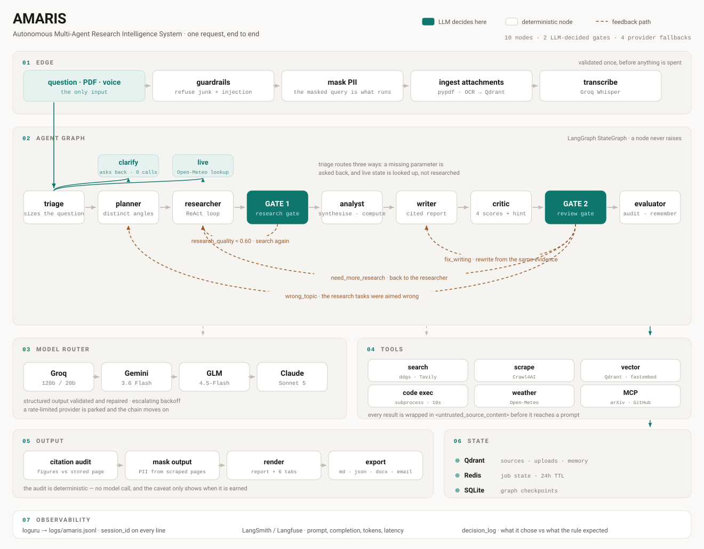

# AMARIS

**Autonomous Multi-Agent Research Intelligence System**

Ask a research question. Agents plan it, research it with a ReAct loop, write it
up, review the draft, and check every figure in that draft against the page it
was cited from. Runs entirely on free tiers.

A supervisor agent picks the next step at run time — but only at the two points
where state does not already determine it. Everywhere else is a plain graph edge,
because asking a model to confirm a decision it was handed is latency, not
autonomy.

| | |
|---|---|
| Graph nodes | 10 |
| LLM-decided gates | 2 |
| Provider fallbacks | 4 (Groq → Gemini → GLM → Anthropic) |
| Tests | 672, 85% coverage |
| Monthly cost | $0 |

---

## Architecture



---

## How it works

**Everything is validated once, at the edge.** Junk and direct prompt injection
are refused, PII is masked, and the masked query is what actually runs. An
uploaded PDF is extracted, chunked and embedded into Qdrant here too — the
document becomes a retrieved source, not a longer prompt.

**Triage sizes the question before anything is spent.** One fast-model call sets
the depth, and every downstream budget derives from it: how many plan tasks, how
many ReAct iterations, how many sources, how long the report. It routes three
ways. A question missing a parameter no search could supply is asked back. A
question about live state is looked up. Everything else goes to the planner.

**The researcher runs a real ReAct loop.** It emits a JSON decision each
iteration — search, fetch, or stop — and a separate system executes it; the model
has no tools of its own. Results are scored for relevance, thin snippets get
scraped, and each task records whether it stopped because it was satisfied or
because it hit the cap. That distinction is surfaced, because a loop where
nothing self-terminates is the cap making every decision.

**Two gates are where a model actually decides.** Gate 1 asks whether the
research is enough to write from. Gate 2 reads the critic's scores and picks the
cheapest real fix: rewrite, re-research, re-plan, or finish. Routing backwards
from a review to *research* is the thing a fixed pipeline cannot express.

**Every decision is recorded against what the rule expected.** The supervisor
appends to `decision_log` — what it chose, what the documented invariant would
have chosen, and whether a model was consulted at all. The trajectory evaluator
scores that log afterwards, so the routing claim is checkable rather than
asserted.

**The citation audit is deterministic.** Because the scraped page text is kept,
the report's own figures, dates and quotes are checked against the page they
cite, with no model call. The caveat only appears when it is earned — an earlier
version graded by word overlap, fired on almost every answer, and taught the
reader to ignore it.

---

## Quick start

```bash
uv sync                      # core stack + dev tools
cp .env.example .env         # PowerShell: Copy-Item .env.example .env
docker compose up -d         # redis + qdrant

uv run uvicorn amaris.api.main:app     # api  :8000
uv run streamlit run frontend/app.py   # ui   :8501
```

One run without the stack:

```bash
uv run python -m amaris.graph.pipeline --query "What is the MCP protocol?"
```

Only `GROQ_API_KEY` is required. uv only, never pip — `pyproject.toml` and
`uv.lock` are the source of truth.

**Optional extras**, imported lazily so a missing one is a reduced run rather
than a crash: `files` (PDF upload), `scraping` (Crawl4AI), `search` (Tavily),
`export` (.docx), `observability` (LangSmith/Langfuse), `mcp`, `evaluation`
(RAGAS).

---

## What it does

| | |
|---|---|
| **Research levels** | `direct` · `brief` · `standard` · `deep` — 1 to 5 tasks, 6 to 20 sources. Triage picks one, or the user overrides it |
| **Citation audit** | Every figure and quote checked against the stored page text, deterministically |
| **Conversations** | Follow-ups carry history; a pronoun is resolved into a standalone search string |
| **Attachments** | PDF upload with offline OCR for scans, retrieved per research task |
| **Voice input** | Groq Whisper, transcript shown before it runs |
| **Live data** | Weather-type questions are looked up from Open-Meteo, not researched |
| **Export** | `.md`, `.json`, `.docx`, or email via Resend |
| **MCP** | Exposes its own tools, and consumes arXiv and GitHub |
| **Inspector** | Six tabs per answer: execution, evidence, sources, evaluation, system, raw |

---

## Deploy

**Hugging Face Spaces.** The `Dockerfile` and the YAML block at the top of this
README are the whole setup.

```bash
git remote add hf https://huggingface.co/spaces/<user>/<space>
git push hf main
```

Set `GROQ_API_KEY` in Space secrets. Add `GEMINI_API_KEY` for a second provider,
and `QDRANT_URL` + `QDRANT_API_KEY` to enable uploads and memory. The image bakes
in `DEPLOYMENT_MODE=cloud`, so Streamlit runs the graph in-process with no Redis
or FastAPI. First build takes 10-15 minutes — Chromium and the embedding model
are fetched at build time so the first visitor doesn't wait on them.

**Streamlit Community Cloud.** Entrypoint `frontend/app.py`. Keep every secret at
the root level of `secrets.toml`; Streamlit only promotes root-level entries to
environment variables.

---

## Stack

| | |
|---|---|
| Orchestration | LangGraph + AsyncSqliteSaver |
| Models | Groq `gpt-oss-120b` / `20b`, falling back to Gemini 3.6 Flash, GLM-4.5-Flash, Claude Sonnet 5 |
| Search & scrape | ddgs, Tavily optional, Crawl4AI |
| Vectors & memory | Qdrant + fastembed (bge-small, ONNX — no torch) |
| Documents | pypdf, pypdfium2, RapidOCR |
| API & UI | FastAPI + WebSockets, Streamlit |
| Observability | loguru → JSONL, LangSmith or Langfuse |
| Safety | regex guardrails, PII masking, injection wrapping |
| Tooling | uv, ruff, pytest |

No CrewAI, no AutoGen. Both would have supplied the multi-agent scaffolding and
hidden the routing, which is the thing this project exists to show.

---

## Tests

```bash
uv run pytest
uv run ruff check . && uv run ruff format --check .
```

672 tests, 85% coverage, no network calls in the default suite. `integration`
tests need Docker; `live_llm` tests are skipped by default.

---

## Docs

Architecture notes, agent prompts, memory boundaries and 46 ADRs live under
`docs/` in the working tree. That directory is gitignored and is not published
here.

## License

MIT — see [LICENSE](LICENSE).
