# AMARIS

**Autonomous Multi-Agent Research Intelligence System**

Ask a research question. Agents plan it, research it with a ReAct loop, write it
up, review the draft, and check every figure in that draft against the page it
was cited from. Runs entirely on free tiers.

A supervisor agent picks the next step at run time — but only at the two points
where state does not already determine it. Everywhere else is a plain graph edge,
because asking a model to confirm a decision it was handed is latency, not
autonomy.

| | |
|---|---|
| Graph nodes | 10 |
| LLM-decided gates | 2 |
| Provider fallbacks | 4 (Groq → Gemini → GLM → Anthropic) |
| Tests | 672, 85% coverage |
| Monthly cost | $0 |

---

## Architecture

```mermaid
flowchart TB
    Q([question · text, PDF, voice]) --> E[edge · guardrails, PII mask]
    E --> T[triage · sizes the run]
    T --> P[planner · splits it up]
    P --> R[researcher · ReAct loop]
    R --> G1{{GATE 1 · enough to write?}}
    G1 --> A[analyst · synthesise]
    A --> W[writer · cited report]
    W --> C[critic · 4 scores + hint]
    C --> G2{{GATE 2 · what next?}}
    G2 --> V([report · citation audit])

    G1 -. "quality under 0.60" .-> R
    G2 -. "fix_writing" .-> W
    G2 -. "need_more_research" .-> R
    G2 -. "wrong_topic" .-> P

    classDef gate fill:#0f766e,stroke:#0f766e,color:#fff;
    classDef io fill:#e6f2f0,stroke:#0f766e,color:#0f766e;
    class G1,G2 gate;
    class Q,V io;
```



Solid arrows are fixed graph edges and cost no model call. The two teal gates are
the only places an LLM picks the next step; the dotted arrows are what they can
send backwards. Triage has two more exits not drawn here — `clarify`, which asks
the question back, and a live lookup for weather-type questions. The stack behind
each box is listed under [Stack](#stack).

---

## How it works

Everything is validated once at the edge. Junk and direct prompt injection are
refused, PII is masked, and the masked query is what actually runs. An uploaded
PDF is extracted, chunked and embedded into Qdrant at the same point, so the
document arrives as a retrieved source rather than a longer prompt.

Triage then sizes the question before anything is spent. One fast-model call sets
the depth, and every downstream budget derives from it — plan tasks, ReAct
iterations, sources read, report length. It routes three ways: a question missing
a parameter that no search could supply is asked back, a question about live
state is looked up from a data source, and everything else goes to the planner.

The researcher is a real ReAct loop rather than a search-then-summarise call.
Each iteration it emits a JSON decision (search, fetch, or stop) and a separate
system executes it — the model has no tools of its own. Results are scored for
relevance, thin snippets get scraped, and every task records whether it stopped
because it was satisfied or because it hit the cap. That distinction is shown in
the UI, because a loop where nothing self-terminates is really the cap making
every decision.

Two gates are the only places a model chooses the next step. Gate 1 asks whether
the research is enough to write from. Gate 2 reads the critic's four scores and
picks the cheapest fix that addresses the real problem: rewrite, re-research,
re-plan, or finish. Routing backwards from a review to *research* is the move a
fixed pipeline cannot express, and it is why the supervisor exists at all.

Both gates log what they did against what the documented rule would have done.
The supervisor appends to `decision_log` — the action it picked, the action the
invariant expected, and whether a model was consulted at all — and the trajectory
evaluator scores that log afterwards. The routing claim is checkable rather than
asserted.

The citation audit closes the loop. Because the scraped page text is kept in
state, the report's own figures, dates and quotes are checked against the page
they cite, with no model call. The caveat only appears when it is earned; an
earlier version graded by word overlap, fired on almost every answer, and taught
the reader to ignore it.

---

## Quick start

```bash
uv sync                      # core stack + dev tools
cp .env.example .env         # PowerShell: Copy-Item .env.example .env
docker compose up -d         # redis + qdrant

uv run uvicorn amaris.api.main:app     # api  :8000
uv run streamlit run frontend/app.py   # ui   :8501
```

One run without the stack:

```bash
uv run python -m amaris.graph.pipeline --query "What is the MCP protocol?"
```

Only `GROQ_API_KEY` is required. uv only, never pip — `pyproject.toml` and
`uv.lock` are the source of truth.

Optional extras are imported lazily, so a missing one gives a reduced run rather
than a crash: `files` (PDF upload), `scraping` (Crawl4AI), `search` (Tavily),
`export` (.docx), `observability` (LangSmith), `mcp`, and `evaluation`
(RAGAS, offline benchmark only).

---

## What it does

| | |
|---|---|
| **Research levels** | `direct` · `brief` · `standard` · `deep` — 1 to 5 tasks, 6 to 20 sources. Triage picks one, or the user overrides it |
| **Citation audit** | Every figure and quote checked against the stored page text, deterministically |
| **Conversations** | Follow-ups carry history; a pronoun is resolved into a standalone search string |
| **Attachments** | PDF upload with offline OCR for scans, retrieved per research task |
| **Voice input** | Groq Whisper, transcript shown before it runs |
| **Live data** | Weather-type questions are looked up from Open-Meteo, not researched |
| **Export** | `.md`, `.json`, `.docx`, or email via Resend |
| **MCP** | Exposes its own tools, and consumes arXiv and GitHub |
| **Inspector** | Six tabs per answer: execution, evidence, sources, evaluation, system, raw |

---

## Deploy

### Hugging Face Spaces

The `Dockerfile` and the YAML block at the top of this README are the whole
setup.

```bash
git remote add hf https://huggingface.co/spaces/<user>/<space>
git push hf main
```

Set `GROQ_API_KEY` in Space secrets. Add `GEMINI_API_KEY` for a second provider,
and `QDRANT_URL` + `QDRANT_API_KEY` to enable uploads and memory. The image bakes
in `DEPLOYMENT_MODE=cloud`, so Streamlit runs the graph in-process with no Redis
or FastAPI. First build takes 10-15 minutes — Chromium and the embedding model
are fetched at build time so the first visitor doesn't wait on them.

### Streamlit Community Cloud

Entrypoint `frontend/app.py`. Keep every secret at the root level of
`secrets.toml`; Streamlit only promotes root-level entries to environment
variables, so anything under a `[section]` header is invisible and the app boots
with no provider configured.

---

## Stack

| | |
|---|---|
| Orchestration | LangGraph + AsyncSqliteSaver |
| Models | Groq `gpt-oss-120b` / `20b`, falling back to Gemini 3.6 Flash, GLM-4.5-Flash, Claude Sonnet 5 |
| Search & scrape | ddgs, Tavily optional, Crawl4AI |
| Vectors & memory | Qdrant + fastembed (bge-small, ONNX — no torch) |
| Documents | pypdf, pypdfium2, RapidOCR |
| API & UI | FastAPI + WebSockets, Streamlit |
| Observability | loguru → JSONL, LangSmith |
| Safety | regex guardrails, PII masking, injection wrapping |
| Tooling | uv, ruff, pytest |

No CrewAI, no AutoGen. Both would have supplied the multi-agent scaffolding and
hidden the routing, which is the thing this project exists to show.

---

## Tests

```bash
uv run pytest
uv run ruff check . && uv run ruff format --check .
```

---


## License

MIT — see [LICENSE](LICENSE).
