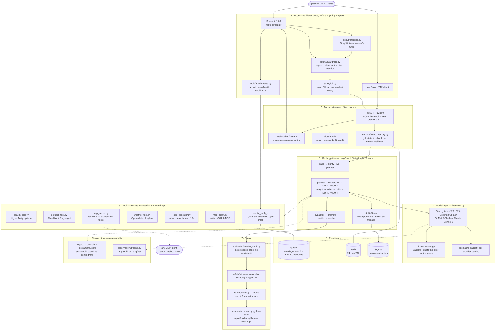
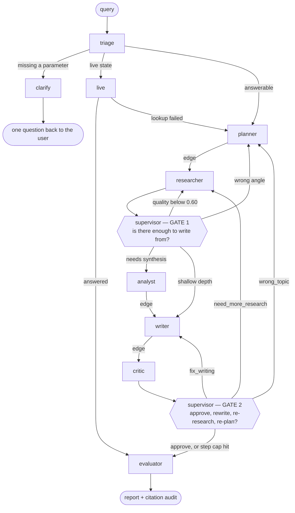

# AMARIS — Autonomous Multi-Agent Research Intelligence System

You ask a research question. The system decides how much the question is worth,
plans it, researches it with a ReAct loop, writes it up, reviews its own draft,
and then checks every figure in that draft against the page it was cited from.

It is agentic in a specific sense, and the distinction is worth being precise
about because most "multi-agent" systems are not. A supervisor agent chooses the
next step at run time, at the two points in the graph where state genuinely does
not determine what should happen next. The critic can send work back to the
researcher, not only to the writer. The same question asked twice can take two
different paths.

The other half of that claim matters just as much: everywhere state *does*
determine the next step, there is no model call at all. An earlier version of
this graph asked an LLM at every hop to re-derive an if-chain it had been handed
as a table. Six calls a run, about 25 seconds, and the path never once varied.
Those hops are plain graph edges now.

Everything runs on free tiers. Monthly cost is zero.

Tier 0 (phases 0-9) and Tier 1 hardening are complete: pipeline, API, UI,
evaluation, safety and observability all run end to end. 672 tests, 85% line
coverage.

<!-- demo: record one run (uvicorn + streamlit, single query, ~90s), save it to
     assets/demo.gif, then uncomment the line below.

-->

---

## End-to-end wire-up

Every layer, from the browser to the stores, with the library that actually does
the work. Dotted lines are optional paths that degrade to a no-op when the
dependency or the service is absent.



Two deployment modes share one codebase. Local mode runs Redis, Qdrant and
FastAPI in Docker. Cloud mode has no Docker, so Streamlit runs the graph
in-process, job state lives in memory, and Redis degrades to a no-op. Modules
find out which mode they are in from `settings.deployment_mode`, and every one of
them has to work in both.

---

## The graph



Two conditional edges, both on a real decision. Everything else is a fixed edge,
because a plan always needs researching and a draft always needs reviewing.

A representative run looks like this:

```
triage → planner → researcher → researcher → researcher → analyst → writer → critic → evaluator
```

Three researcher visits, because the supervisor read `research_quality` and sent
the work back twice. `max_supervisor_steps` (default 15) is a hard ceiling, so
the loop terminates even though a model is picking the path.

Skips are recorded, not just performed. Every supervisor decision appends to
`decision_log` with what it chose, what the documented rule table would have
chosen, and whether a model was consulted at all (`llm_decided: false` when state
settled it). The trajectory evaluator reads that log back, so the claim about
spending calls only where they matter is checkable rather than asserted.

---

## Agents

| Agent | What it decides | Model | Skipped when |
|---|---|---|---|
| triage | how much the question is worth, and whether it is answerable as written | gpt-oss-20b, T=0.0 | the user picked a depth, or it is a live-data question |
| clarify | nothing — writes back the one missing parameter | none | the question stands on its own |
| live | nothing — reads current conditions from a data source | none | not a live-state question |
| planner | how many distinct angles the question has | gpt-oss-120b, T=0.3 | a one-task budget, where the plan is the query |
| researcher | whether it has read enough, or should search again | gpt-oss-20b, T=0.2 | never |
| supervisor | gate 1 and gate 2 — what runs next | gpt-oss-20b, T=0.0 | state already settles it |
| analyst | whether the evidence needs synthesis or computation | gpt-oss-120b, T=0.3 | `direct` and `brief` depths |
| writer | the report itself, in the sections triage asked for | gpt-oss-120b, T=0.5 | never |
| critic | four-dimension score, plus the `routing_hint` the supervisor reads | gpt-oss-120b, T=0.1 | never |
| evaluator | nothing — promotes the draft, audits it, stores the finding | none | never, it is the terminal node |

The researcher is a real ReAct loop rather than a search-then-summarise call. It
searches, scores relevance, scrapes the pages whose snippets were too thin, and
decides for itself whether it has enough. `max_react_iterations` caps it but does
not drive it, and `react_stats` records per task whether it self-terminated or
hit the cap. The UI shows that, because a run where nothing self-terminates means
the cap is doing the deciding and the loop is decorative.

### Provider chain

`Groq → Gemini → GLM → Anthropic`, with `PRIMARY_PROVIDER` able to promote any of
them to the head. Groq leads by default because it measured about 1.8s against
GLM's 16.9s on the same prompt. Short structured decisions (routing, triage, and
the researcher's many small calls) use the 20b model; planning, analysis, writing
and critique use the 120b. Putting the 120b model on a routing hop cost about 4
seconds of latency for a one-word answer, which is why the split exists.

Only `GROQ_API_KEY` is genuinely required. A 429 with no stated retry delay parks
that provider and escalates its backoff instead of hammering it. Structured
output is validated against a Pydantic model, and on a parse failure the model is
re-asked with its own error quoted back to it.

---

## Running it locally

```bash
uv sync                      # core stack + dev tools
cp .env.example .env         # PowerShell: Copy-Item .env.example .env
docker compose up -d         # redis + qdrant

# a single run, straight to the terminal
uv run python -m amaris.graph.pipeline --query "What is the MCP protocol?"

# or the full stack
uv run uvicorn amaris.api.main:app     # api on :8000
uv run streamlit run frontend/app.py   # ui on :8501
```

uv only, never pip. `pyproject.toml` and `uv.lock` are the source of truth and
there is no `requirements.txt`. Heavy dependencies are optional extras, imported
lazily at the call site, so a missing extra produces a reduced run rather than a
crash.

| Extra | What it adds | What it costs |
|---|---|---|
| `files` | PDF upload: pypdf, pypdfium2, RapidOCR, fastembed | ONNX only, no torch |
| `scraping` | Crawl4AI | pulls Playwright and a browser |
| `search` | Tavily as a second search provider | free up to 1000 queries/month |
| `export` | `.docx` export | pure Python, lxml only |
| `observability` | LangSmith / Langfuse tracing | small |
| `mcp` | MCP server and client | needs node/uv at run time |
| `evaluation` | RAGAS benchmark harness | heavy, offline use only |
| `full` | search + mcp + observability + evaluation | — |

### Configuration

Every knob is a typed field on one `pydantic-settings` class, settable through
`.env`. `.env.example` carries the ones worth tuning first. API keys are
`SecretStr`, so a stray `repr()` of the settings object cannot print one.

| Setting | Default | Effect |
|---|---|---|
| `DEPLOYMENT_MODE` | `local` | `local` = Docker + FastAPI, `cloud` = in-process Streamlit |
| `PRIMARY_PROVIDER` | `groq` | which provider heads the fallback chain |
| `EVAL_PROVIDER` | `gemini` | the judge uses quota the pipeline did not just spend |
| `MAX_SUPERVISOR_STEPS` | `15` | hard stop on the agentic loop |
| `RESEARCH_QUALITY_THRESHOLD` | `0.60` | below this, gate 1 sends the work back |
| `QUALITY_APPROVE_THRESHOLD` | `0.72` | at or above this, gate 2 approves |
| `MAX_SOURCES_IN_PROMPT` | `20` | ceiling on any agent's source list |
| `RELEVANCE_FLOOR` | `0.35` | drops sources that matched the query only in passing |
| `LLM_RETRY_BUDGET_SECONDS` | `150` | must exceed the slowest single request, or no retry is possible |
| `ATTACHMENT_RETENTION_HOURS` | `24` | uploads older than this are swept at startup |
| `MCP_CLIENT_ENABLED` | `false` | off by default: it spawns `npx`/`uvx` subprocesses |

---

## Features

### Research level

Triage sizes every question itself and biases shallow on purpose, since a reader
can ask for more depth in one click but cannot un-read a report they did not
want. A picker above the composer overrides that, and it shows the budget before
the run starts rather than after.

| Level | Tasks | ReAct loops | Sources | Analyst | Words | Revisions | Typical |
|---|---|---|---|---|---|---|---|
| `direct` | 1 | 1 | 6 | no | ~120 | 1 | seconds |
| `brief` | 2 | 2 | 8 | no | ~300 | 1 | 1-2 min |
| `standard` | 3 | 3 | 12 | yes | ~700 | 2 | 2-3 min |
| `deep` | 5 | 4 | 20 | yes | ~1100 | 2 | 3-6 min |
| `auto` | triage decides, and spends one 20b call doing it | | | | | | |

Depth is not cosmetic here. `deep` used to read exactly as many sources as
`standard`, so all it bought was a longer report written from the same evidence;
its budget and `MAX_SOURCES_IN_PROMPT` were both raised to 20 to fix that. When
the user picks a level, triage makes no model call at all.

### Conversations

Follow-ups carry history. Triage rewrites "what about his brother?" into a
standalone sentence before anything searches on it, because that string is what
the search actually runs. The answer still addresses the question as the user
asked it.

### Attachments

Uploads are PDF only. pypdf reads the text layer; when there isn't one,
pypdfium2 rasterises the page at 2x and RapidOCR reads it offline, so a scan
still parses when the vision API is rate limited, which on the free Gemini tier
it regularly is. Chunks are embedded with bge-small (384-dim, ONNX, no torch)
into Qdrant and retrieved per research task. The document is a retrieved source,
not a longer question.

Uploads are deleted when the conversation ends, and swept on a timer for the
conversations that end by someone closing the tab.

### Voice input

Groq serves Whisper on the same free key, so there is no local model and no
second provider. The transcript is displayed rather than run silently: Whisper
mishears technical terms, and finding that out costs a full pipeline run.

### Live data

"Weather in Darbhanga right now" is answered from Open-Meteo in about 6 seconds.
Scraping for it returns last month's averages, and picking `deep` does not make
scraping the right way to find out what the temperature is. The reading itself
becomes the cited source, so the audit checks the figures against it. If the
lookup fails, the run falls back to the normal research path.

### Export

`.md`, `.json`, `.docx`, or emailed. The DOCX is built in-process from the same
markdown-it token stream the UI renders, so there is no second markdown dialect
to keep in sync. Email goes over Resend's HTTP API, which needs no new dependency
because httpx is already core. It is gated three ways: no API key means the
control is not rendered, cloud mode refuses to send until an allow-list names the
domains it may reach, and there is a per-session cap.

### MCP, in both directions

`mcp_server.py` exposes AMARIS's own tools to any MCP client. `mcp_client.py`
consumes external ones: arXiv for papers, GitHub's hosted endpoint for code and
releases, and a filesystem server that is refused outright in cloud mode, because
a query-derived glob against a public container is an enumeration primitive
rather than a research source. Results come back as untrusted input and are
wrapped exactly like a scraped page.

### The inspector

Under every answer the UI has six tabs: execution, evidence, sources, evaluation,
system, raw. They show the supervisor's routing decisions against the documented
rule table with a `diverged` flag when the LLM overruled it, the ReAct iteration
counts per task, what the critic actually wrote rather than only its score, the
citation audit, and the raw payload every number above was read from.

---

## Evaluation

RAGAS used to run on every user question. That was a misuse of it. It cost about
40 seconds after the answer was already written, for four numbers nobody reading
an answer had asked for, and it is not a different kind of intelligence anyway:
its judge wraps the same router the pipeline had just spent. A "what is mango?"
run took 112 seconds. Taking it off the request path brought the same question to
50 seconds, with more sources and a revision.

So the three layers now run where each belongs.

| Layer | What it scores | When | How |
|---|---|---|---|
| Citation audit | the report's facts against the pages it cites | every answer | deterministic, no model call, no dependency |
| Retrieval + report | sources vs query, report vs sources | offline | RAGAS over an 18-query golden set |
| Trajectory | the routing path itself | offline | custom metrics, no LLM calls |

### Citation audit

This is the part that needs the architecture to be possible at all. AMARIS keeps
the page text it scraped in `raw_research[].content`, so a claim can be checked
against what was actually read. A hosted research tool shows you a link and
trusts the model's attribution.

Only verifiable facts are graded: figures, dates and quoted text. The first
version scored whole sentences by content-word overlap, which punished paraphrase
and fired a warning on nearly every well-written answer, and a warning that
appears every time teaches the reader to ignore it. A citation whose page was
never stored counts as dead, which is unverifiable rather than merely low. Source
diversity and freshness are counted too, two axes RAGAS does not cover.

The caveat has to be earned before it is shown: a dead citation, two or more
unsupported claims, or one unsupported claim on a very short answer. When it does
fire it names the figures it could not find, so it points somewhere specific.

### Trajectory

`routing_agreement` re-derives the documented supervisor rule table and checks
whether the LLM actually followed it. `react_discipline` measures how often the
researcher stopped because it was satisfied rather than because it ran out of
iterations. Neither needs a judge, so both keep working when the judge is rate
limited.

```bash
uv sync --extra evaluation
uv run python -m amaris.evaluation.harness --golden tests/golden/queries.yaml
```

---

## Safety

Regex only, with no model call and no extra dependency. A safety layer that needs
an LLM fails at exactly the moment the LLM is already failing.

Input is validated once at the edge: junk and high-risk direct injection are
refused, PII is masked, and the masked query is what runs. Output is masked again
for PII that came in from scraped pages, but output masking never blocks.

Retrieved content is wrapped rather than blocked. Every scraped page, tool result
and MCP response is delimited in `<untrusted_source_content>` tags with a
standing instruction that the text inside is data to analyse and never
instructions to follow. A page cannot close the wrapper early, because both tags
are neutralised in the content first. Indirect injection is the real risk for
anything that fetches arbitrary URLs and feeds them to a model, and blocking
scraped text would quietly kill legitimate research, so it is contained instead.

Code execution is a sandboxed subprocess with a 10-second timeout. There is no
`eval` and no `exec` anywhere in the codebase.

A visitor's own API key, on a shared deployment, lives in a `ContextVar` rather
than in `os.environ` or the settings singleton. One Streamlit process serves
every concurrent visitor, so both process-global alternatives hand one stranger's
key to the next stranger's run, and do it silently: nothing fails, the second
visitor simply spends someone else's quota. The key is never logged, never
written to disk, and deliberately excluded from the checkpointed state, since
checkpoints are replayable.

---

## Observability

Because a model chooses the execution path, re-running a query is not a
reproduction of the earlier run. Every run is keyed on a `session_id` bound
through contextvars to every log line beneath it.

```
16:42:43.199 INFO  36333434:supervisor  supervisor.route       next_agent=researcher quality=0.0
16:42:43.199 DEBUG 36333434:researcher  researcher.react_step  task_id=t1 iteration=1
16:42:43.199 WARN  36333434:researcher  llm.fallback           provider=groq to=gemini reason=429
```

The contract is a dotted event name as the message and structured values in
`bind()`. A value buried in an f-string cannot be filtered on later. The same
records land in `logs/amaris.jsonl`, errors are mirrored to `logs/errors.jsonl`,
and filtering `supervisor.route` for one session prints the exact path the system
took.

Logs say what the graph did. Tracing says what the models were asked: prompt,
completion, token count and latency per call. Setting `LANGSMITH_API_KEY` turns
it on, with nothing to attach, because LangChain reads those environment
variables itself. Langfuse works too, through a callback handler that LangGraph
propagates into every nested call. Both are optional, and a tracer that cannot
start logs a warning instead of taking the run down.

---

## Storage

| Store | Holds | Lifetime | If absent |
|---|---|---|---|
| Redis | job state and progress pubsub | 24h TTL | in-memory fallback, always available |
| Qdrant `amaris_research` | scraped sources and uploaded document chunks | attachments swept after `ATTACHMENT_RETENTION_HOURS` | search returns `[]` |
| Qdrant `amaris_memories` | episodic memory: findings and session summaries | persistent | recall returns `[]` |
| SQLite `checkpoints.db` | LangGraph checkpoints, so a crashed run can resume | newest 50 threads | required in local mode |

Episodic memory runs on Qdrant rather than mem0. mem0's configuration here used a
HuggingFace embedder, which pulls sentence-transformers, which pulls torch at
about 2GB, so it sat behind an extra that cloud mode cannot install and it was
never actually running. Measured on a working checkout: `is_available()` false,
`recall_related()` returning `[]`, three call sites all no-ops. The system
documented long-term memory and had none. Near-duplicates are now suppressed by
cosine distance at 0.95 instead of by a model call, which is the same spending
rule applied to storage.

---

## API

Local mode only. Cloud mode calls the graph in-process and there is no HTTP
server.

| Method | Path | Purpose |
|---|---|---|
| `POST` | `/research` | takes a query, returns a `job_id` immediately (202) |
| `GET` | `/research/{job_id}` | status, current agent, progress, result |
| `WS` | `/research/{job_id}/stream` | live node transitions |
| `GET` | `/health`, `/ready` | liveness, readiness |

```bash
curl -X POST localhost:8000/research \
     -H "Content-Type: application/json" \
     -d '{"query":"What is the MCP protocol?","depth":"brief"}'
```

The run outlives the request. It is an `asyncio` task tracked in the job store,
so a client that disconnects does not kill it. Progress is weighted by which
agent is active and clamped monotonic, because a critic-to-researcher re-route
would otherwise walk the bar backwards. The frontend consumes WebSocket events
instead of polling. `/ready` fails on configuration errors but not on a missing
optional dependency, since a reduced run is still a working service.

---

## Deploying to Hugging Face Spaces

The repo ships a `Dockerfile` for a Docker Space. The YAML block at the top of
this README is the Space configuration Hugging Face reads, so pushing the repo is
all the setup there is.

```bash
# on huggingface.co: New Space → SDK: Docker → Blank
git remote add hf https://huggingface.co/spaces/<user>/<space>
git push hf main
```

Then set these in Space Settings → Variables and secrets. They arrive as
environment variables at run time, which is how `pydantic-settings` reads them.

| Name | Kind | Notes |
|---|---|---|
| `GROQ_API_KEY` | secret | required; everything else is a fallback |
| `GEMINI_API_KEY` | secret | recommended: second provider, and the evaluator's judge |
| `QDRANT_URL`, `QDRANT_API_KEY` | secret | Qdrant Cloud free tier (1GB). Without it, uploads and memory are off |
| `TAVILY_API_KEY` | secret | optional second search provider |
| `LANGSMITH_API_KEY` | secret | optional tracing |
| `DEPLOYMENT_MODE` | variable | already `cloud` in the image; set it again only to override |

Things worth knowing about that environment, because they change how the app
behaves:

- The container runs as UID 1000 and the Dockerfile builds everything under that
  user. Anything copied in without `--chown=user` fails at run time.
- Disk is wiped on every restart. `checkpoints.db` and the logs are written to
  `/tmp` deliberately, since they are caches rather than records. Anything that
  must survive belongs in Qdrant Cloud.
- There is no Redis and no FastAPI. `DEPLOYMENT_MODE=cloud` is baked into the
  image, so Streamlit runs the graph in-process and job state lives in memory.
- The first build takes roughly 10-15 minutes. Chromium and the bge-small ONNX
  model are both fetched at build time so the first visitor does not pay for them.
- The filesystem MCP server is refused in cloud mode by the code, not by
  configuration. A public Space answers questions from strangers.
- Visitors can enter their own provider key rather than draining the Space's
  quota. It stays in their session and reaches nothing else.

### Streamlit Community Cloud

Also supported, with `frontend/app.py` as the entrypoint. Community Cloud reads
`uv.lock` ahead of `requirements.txt`, so the committed lock is the dependency
file and no pip export is needed. Paste
[.streamlit/secrets.toml.example](.streamlit/secrets.toml.example) into the app's
Secrets box and keep every key at the root level: Streamlit only promotes
root-level entries to environment variables, so anything nested under a
`[section]` is invisible and the app boots with no provider configured. This path
installs core dependencies only, which means no scraping, so the citation audit
has thinner page text to check against.

---

## Tests

```bash
uv run pytest
uv run pytest --cov=amaris --cov-report=term-missing
uv run ruff check . && uv run ruff format --check .
```

672 tests, 85% line coverage, and no network calls in the default suite: every
LLM, search and store is a test double. Tests marked `integration` need
`docker compose up`; tests marked `live_llm` make a real provider call and are
skipped by default. Ruff runs `E, F, I, UP, B, ASYNC, S, C4, SIM, TC, RUF` at a
100-column line length, and a hook formats every `.py` on write.

---

## Stack

| Layer | Choice | Cost |
|---|---|---|
| Orchestration | LangGraph, SqliteSaver checkpointing | open source |
| Models | Groq `gpt-oss-120b` / `gpt-oss-20b` | free, no card |
| Fallbacks | Gemini 3.6 Flash, GLM-4.5-Flash via Z.ai, Claude Sonnet 5 | free, free, paid last resort |
| Search | ddgs (DuckDuckGo), Tavily optional | free / 1000 per month |
| Scraping | Crawl4AI on Playwright | open source |
| Vectors | Qdrant + fastembed (bge-small, ONNX) | open source / 1GB cloud |
| Documents | pypdf, pypdfium2, RapidOCR | open source |
| Speech | Groq Whisper `large-v3-turbo` | free, same key |
| Live data | Open-Meteo | keyless |
| Job state | Redis, with in-memory fallback | open source |
| Evaluation | citation audit (custom), RAGAS offline, trajectory metrics (custom) | open source |
| Interop | MCP — FastMCP server, client for arXiv and GitHub | open source |
| API | FastAPI, uvicorn, WebSockets | — |
| UI | Streamlit with custom CSS | free |
| Logging | loguru to console and JSONL | — |
| Tracing | LangSmith or Langfuse | free tier |
| Safety | regex guardrails, PII masking, injection wrapping | no dependency |
| Export | python-docx, Resend over httpx | free tier |
| Tooling | uv, ruff, pytest | — |

---

## Documentation

The PRD, architecture notes, every agent's system prompt, the memory boundaries,
the safety model and the full ADR log live under `docs/` in the working tree.
That directory is gitignored and is not published here.

## License

MIT. See [LICENSE](LICENSE).
